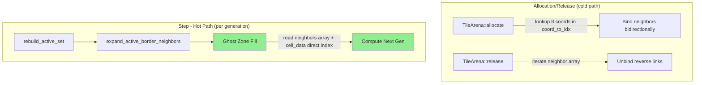

# Design Document: Neighbor Pre-Binding

## Overview

This feature eliminates `FxHashMap` lookups from the per-generation hot path by pre-caching each tile's 8 neighbor indices in a fixed-size array. Neighbor links are maintained bidirectionally during tile allocation and release, so the ghost zone fill phase can use direct array indexing (`cell_data[neighbor_idx.index()]`) instead of hash lookups (`coord_to_idx.get(&coord)`).

The change is purely internal to the arena and sync layers. The public API (`set_cell`, `get_cell`, `step`, `population`, etc.) remains unchanged. The `coord_to_idx` HashMap is retained for coordinate-based lookups during allocation, `set_cell`, `get_cell`, and activity management — it is simply removed from the hot path.

## Architecture

The modification touches four modules:

1. **tile.rs** — Add `Direction` enum and `Neighbors` type alias
2. **arena.rs** — Add `neighbors` parallel array, update `allocate()` and `release()` with bidirectional linking/unlinking
3. **sync.rs** — Rewrite `fill_ghost_zone_direct()` to accept neighbor indices instead of `coord_to_idx`
4. **engine.rs** — Update both serial and parallel paths to pass neighbor data instead of `coord_to_idx`



## Components and Interfaces

### Direction Enum (tile.rs)

```rust
#[derive(Clone, Copy, Debug, PartialEq, Eq)]
#[repr(u8)]
pub enum Direction {
    North = 0,  // (tx, ty+1)
    South = 1,  // (tx, ty-1)
    West  = 2,  // (tx-1, ty)
    East  = 3,  // (tx+1, ty)
    NW    = 4,  // (tx-1, ty+1)
    NE    = 5,  // (tx+1, ty+1)
    SW    = 6,  // (tx-1, ty-1)
    SE    = 7,  // (tx+1, ty-1)
}

impl Direction {
    pub const ALL: [Direction; 8] = [
        Direction::North, Direction::South,
        Direction::West,  Direction::East,
        Direction::NW,    Direction::NE,
        Direction::SW,    Direction::SE,
    ];

    /// The coordinate offset for this direction.
    pub const fn offset(self) -> (i64, i64) {
        match self {
            Direction::North => (0, 1),
            Direction::South => (0, -1),
            Direction::West  => (-1, 0),
            Direction::East  => (1, 0),
            Direction::NW    => (-1, 1),
            Direction::NE    => (1, 1),
            Direction::SW    => (-1, -1),
            Direction::SE    => (1, -1),
        }
    }

    /// The reverse direction (for bidirectional linking).
    pub const fn reverse(self) -> Direction {
        match self {
            Direction::North => Direction::South,
            Direction::South => Direction::North,
            Direction::West  => Direction::East,
            Direction::East  => Direction::West,
            Direction::NW    => Direction::SE,
            Direction::NE    => Direction::SW,
            Direction::SW    => Direction::NE,
            Direction::SE    => Direction::NW,
        }
    }

    pub const fn index(self) -> usize {
        self as usize
    }
}
```

### Neighbors Type (tile.rs)

```rust
pub type Neighbors = [Option<TileIdx>; 8];

pub const EMPTY_NEIGHBORS: Neighbors = [None; 8];
```

### TileArena Changes (arena.rs)

Add a third parallel array:

```rust
pub struct TileArena {
    pub cell_data: Vec<TileCells>,
    pub meta: Vec<TileMeta>,
    pub neighbors: Vec<Neighbors>,  // NEW
    pub coord_to_idx: FxHashMap<(i64, i64), TileIdx>,
    pub free_list: Vec<TileIdx>,
}
```

#### allocate() — with neighbor binding

```rust
pub fn allocate(&mut self, coord: (i64, i64)) -> TileIdx {
    if let Some(existing) = self.idx_at(coord) {
        return existing;
    }

    let idx = if let Some(recycled) = self.free_list.pop() {
        self.cell_data[recycled.index()] = TileCells::empty(coord);
        self.meta[recycled.index()] = TileMeta::empty();
        self.neighbors[recycled.index()] = EMPTY_NEIGHBORS;
        recycled
    } else {
        let idx = TileIdx(self.cell_data.len() as u32);
        self.cell_data.push(TileCells::empty(coord));
        self.meta.push(TileMeta::empty());
        self.neighbors.push(EMPTY_NEIGHBORS);
        idx
    };

    self.coord_to_idx.insert(coord, idx);

    // Bind neighbors bidirectionally
    for dir in Direction::ALL {
        let (dx, dy) = dir.offset();
        let neighbor_coord = (coord.0 + dx, coord.1 + dy);
        if let Some(neighbor_idx) = self.coord_to_idx.get(&neighbor_coord).copied() {
            self.neighbors[idx.index()][dir.index()] = Some(neighbor_idx);
            self.neighbors[neighbor_idx.index()][dir.reverse().index()] = Some(idx);
        }
    }

    idx
}
```

#### release() — with neighbor unlinking

```rust
pub fn release(&mut self, idx: TileIdx) {
    if !self.meta[idx.index()].occupied {
        return;
    }

    // Unlink neighbors
    for dir in Direction::ALL {
        if let Some(neighbor_idx) = self.neighbors[idx.index()][dir.index()] {
            self.neighbors[neighbor_idx.index()][dir.reverse().index()] = None;
        }
    }
    self.neighbors[idx.index()] = EMPTY_NEIGHBORS;

    let coord = self.cell_data[idx.index()].coord;
    self.coord_to_idx.remove(&coord);
    self.cell_data[idx.index()].cells = [[0; 64]; 2];
    self.cell_data[idx.index()].border = Default::default();
    self.meta[idx.index()] = TileMeta::released();
    self.free_list.push(idx);
}
```

### Sync Module Changes (sync.rs)

Replace `coord_to_idx` parameter with `neighbors` slice:

```rust
pub unsafe fn fill_ghost_zone_direct(
    idx: TileIdx,
    cell_data: &[TileCells],
    meta_ptr: *mut TileMeta,
    neighbors: &[Neighbors],
) {
    let nb = &neighbors[idx.index()];

    let border_of = |dir: usize| -> BorderData {
        nb[dir]
            .map(|ni| cell_data[ni.index()].border)
            .unwrap_or_default()
    };

    let north = border_of(Direction::North.index());
    let south = border_of(Direction::South.index());
    let west  = border_of(Direction::West.index());
    let east  = border_of(Direction::East.index());
    let nw    = border_of(Direction::NW.index());
    let ne    = border_of(Direction::NE.index());
    let sw    = border_of(Direction::SW.index());
    let se    = border_of(Direction::SE.index());

    let ghost = GhostZone {
        north: north.south,
        south: south.north,
        west: west.east,
        east: east.west,
        nw: nw.se,
        ne: ne.sw,
        sw: sw.ne,
        se: se.nw,
    };

    unsafe {
        (*meta_ptr.add(idx.index())).ghost = ghost;
    }
}
```

### Engine Changes (engine.rs)

#### Parallel path

Pass `&arena.neighbors` instead of `&arena.coord_to_idx`:

```rust
let neighbors = &self.arena.neighbors;
let cell_data = &self.arena.cell_data;

active_set.par_iter().for_each({
    let meta_ptr = meta_ptr;
    move |&idx| {
        let p = meta_ptr.get();
        let m = unsafe { &*p.add(idx.index()) };
        if !m.occupied || !m.active { return; }
        unsafe {
            fill_ghost_zone_direct(idx, cell_data, p, neighbors);
        }
    }
});
```

#### Serial path

Replace the inline `border_of` closure with direct neighbor array reads:

```rust
for &idx in &active_set {
    let m = &self.arena.meta[idx.index()];
    if !m.occupied || !m.active { continue; }

    let nb = &self.arena.neighbors[idx.index()];
    let border_of = |dir: usize| -> BorderData {
        nb[dir]
            .map(|ni| self.arena.cell_data[ni.index()].border)
            .unwrap_or_default()
    };

    let north = border_of(Direction::North.index());
    let south = border_of(Direction::South.index());
    // ... same pattern for all 8 directions

    self.arena.meta[idx.index()].ghost = GhostZone {
        north: north.south,
        south: south.north,
        west: west.east,
        east: east.west,
        nw: nw.se,
        ne: ne.sw,
        sw: sw.ne,
        se: se.nw,
    };
}
```

## Data Models

### New Types

| Type | Definition | Location |
|------|-----------|----------|
| `Direction` | `#[repr(u8)] enum` with 8 variants (N=0..SE=7) | `tile.rs` |
| `Neighbors` | `[Option<TileIdx>; 8]` type alias | `tile.rs` |
| `EMPTY_NEIGHBORS` | `[None; 8]` constant | `tile.rs` |

### Modified Structures

| Structure | Change | Location |
|-----------|--------|----------|
| `TileArena` | Add `pub neighbors: Vec<Neighbors>` parallel array | `arena.rs` |

### Memory Impact

Each `Neighbors` array is `8 × Option<TileIdx>` = `8 × 4 bytes` = 32 bytes per tile slot (with niche optimization, `Option<TileIdx>` is 4 bytes since `TileIdx` wraps a `u32` — actually `Option<TileIdx>` will be 8 bytes without a niche, so 64 bytes per slot). For 4,096 active tiles, this adds ~256 KB — negligible compared to the `TileCells` arrays (each is ~8 KB).

**Note**: If `TileIdx(u32)` doesn't have a niche, `Option<TileIdx>` will be 8 bytes. We could add a niche by using `NonZeroU32` internally (reserving index 0 as sentinel), but this is an optional optimization not required for correctness. The simpler approach is to accept the 64-byte-per-slot cost.

### Invariants

1. `neighbors.len() == cell_data.len() == meta.len()` — parallel arrays stay in sync
2. For any occupied tile at index `i` with `neighbors[i][d] == Some(j)`: `neighbors[j][reverse(d)] == Some(i)` (bidirectional symmetry)
3. For any occupied tile at index `i` with `neighbors[i][d] == Some(j)`: tile `j` is occupied and `cell_data[j].coord == cell_data[i].coord + offset(d)` (coordinate consistency)
4. For any occupied tile at index `i` with `neighbors[i][d] == None`: no occupied tile exists at `cell_data[i].coord + offset(d)` (completeness)


## Correctness Properties

*A property is a characteristic or behavior that should hold true across all valid executions of a system — essentially, a formal statement about what the system should do. Properties serve as the bridge between human-readable specifications and machine-verifiable correctness guarantees.*

The prework analysis identified four consolidated properties after eliminating redundancy. Requirements 8.1, 8.2, 8.3, 1.3, 2.1, 2.2, 3.1, and 3.2 all contribute to a single comprehensive consistency invariant. Requirements 5.2 and 7.1 are related but test at different levels (unit vs integration).

### Property 1: Neighbor Consistency Invariant

*For any* sequence of `allocate` and `release` operations on a `TileArena`, after each operation the following must hold for all occupied tiles:
- (a) Bidirectional symmetry: if `neighbors[i][d] == Some(j)`, then `neighbors[j][reverse(d)] == Some(i)`
- (b) Coordinate consistency: if `neighbors[i][d] == Some(j)`, then tile `j` is occupied and `cell_data[j].coord == cell_data[i].coord + offset(d)`
- (c) Completeness: if `neighbors[i][d] == None`, then no occupied tile exists at `cell_data[i].coord + offset(d)`
- (d) Unoccupied slots have all-None neighbor arrays

**Validates: Requirements 8.1, 8.2, 8.3, 1.3, 2.1, 2.2, 3.1, 3.2**

### Property 2: Allocation Idempotence

*For any* `TileArena` state and any coordinate `(tx, ty)` that already has an allocated tile, calling `allocate((tx, ty))` returns the existing `TileIdx` and the entire `neighbors` array (for all tiles) remains unchanged.

**Validates: Requirements 2.3**

### Property 3: Ghost Zone Equivalence

*For any* `TileArena` state with occupied tiles and valid neighbor arrays, filling a tile's ghost zone using the pre-bound neighbor indices produces an identical `GhostZone` value as filling it using `coord_to_idx` HashMap lookups.

**Validates: Requirements 5.2, 4.1, 4.2**

### Property 4: Behavioral Preservation (Simulation Round-Trip)

*For any* random initial cell pattern, running the engine for N generations produces identical live cell sets as a naive reference implementation of Conway's Game of Life.

**Validates: Requirements 7.1, 7.2, 7.3**

## Error Handling

This feature does not introduce new error conditions. The existing error handling remains:

- **Double allocation**: `allocate()` at an existing coordinate returns the existing index (no-op for neighbor arrays). No error.
- **Double release**: `release()` on an unoccupied slot returns early. No error, no neighbor array modifications.
- **Missing neighbors**: `None` entries in the neighbor array produce default (all-zero) `BorderData`, matching the existing behavior when `coord_to_idx.get()` returns `None`.
- **Stale indices**: Cannot occur because `release()` clears all reverse links before marking the slot as unoccupied. The bidirectional invariant (Property 1) guarantees no dangling references.

## Testing Strategy

### Property-Based Testing

Use the `proptest` crate for property-based testing. Each property test runs a minimum of 100 iterations with randomly generated inputs.

**Library**: `proptest` (add as dev-dependency)

**Test Configuration**:
- Minimum 100 cases per property
- Each test tagged with: `// Feature: neighbor-prebinding, Property N: <title>`

**Property 1 — Neighbor Consistency Invariant**:
- Generate random sequences of `(allocate | release)` operations on coordinates within a bounded range (e.g., -5..5 for both tx and ty)
- After each operation, verify all four sub-properties (symmetry, coordinate consistency, completeness, unoccupied-clean)
- This single test covers requirements 8.1, 8.2, 8.3, 1.3, 2.1, 2.2, 3.1, 3.2

**Property 2 — Allocation Idempotence**:
- Generate a random sequence of allocations to build an arena state
- Pick a random already-allocated coordinate
- Snapshot the full `neighbors` array
- Call `allocate` again on that coordinate
- Verify returned index matches and `neighbors` array is unchanged

**Property 3 — Ghost Zone Equivalence**:
- Generate a random arena state with random cell data
- For each occupied tile, compute ghost zone via both methods (neighbor-array-based and HashMap-based)
- Assert the two `GhostZone` values are identical

**Property 4 — Behavioral Preservation**:
- Generate random initial patterns on a small grid (e.g., 128×128)
- Run the TurboLife engine for N steps
- Run a naive reference implementation for N steps
- Compare live cell sets
- Note: The existing parity tests (TurboLife vs QuickLife) already serve this purpose. The property test adds randomized coverage.

### Unit Tests

Unit tests complement property tests by covering specific examples and edge cases:

- **Direction mapping**: Verify each direction's offset and reverse are correct (8 specific cases)
- **Single tile allocation**: Allocate one tile, verify all neighbors are None
- **Two adjacent tiles**: Allocate two tiles sharing an edge, verify bidirectional link
- **Release middle tile**: Allocate 3 tiles in a row, release the middle one, verify outer tiles' links are cleared
- **Release already-unoccupied**: Verify no-op behavior
- **Ghost zone with no neighbors**: Single isolated tile gets all-zero ghost zone
- **Ghost zone with partial neighbors**: Tile with some but not all neighbors gets correct mix of real and default border data

### Existing Tests

All existing tests must pass without modification:
- `tests/turbolife.rs` — unit tests for TurboLife engine behavior
- `tests/parity.rs` — parity tests between QuickLife and TurboLife
